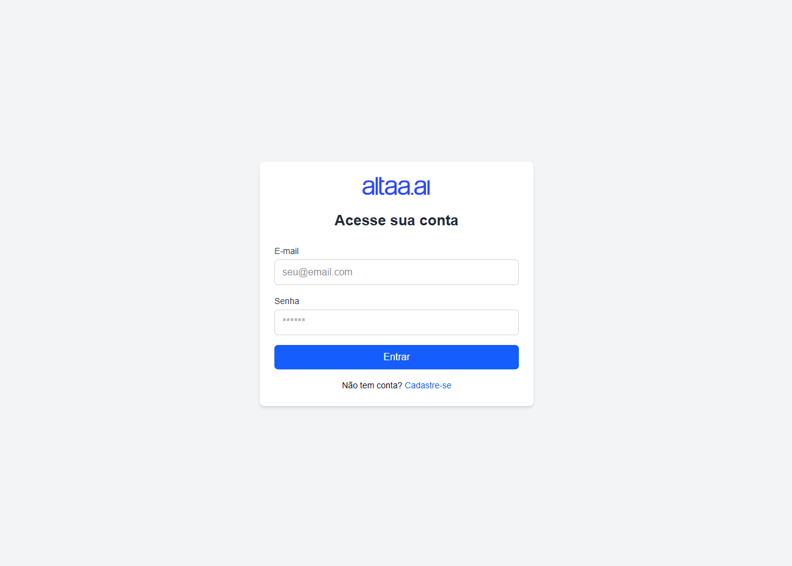
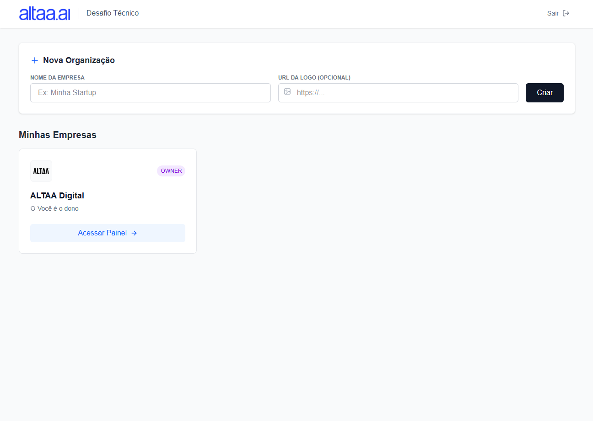
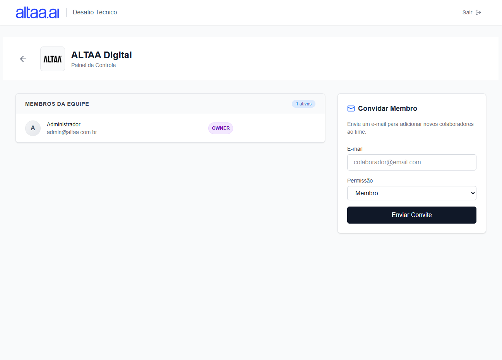
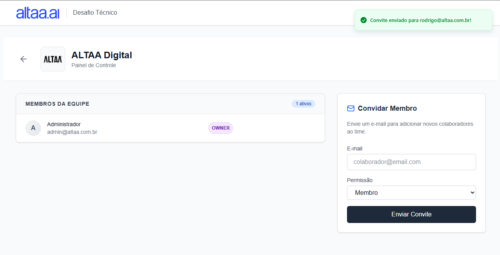
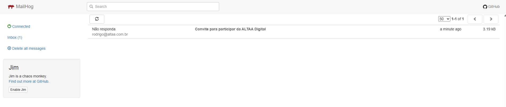
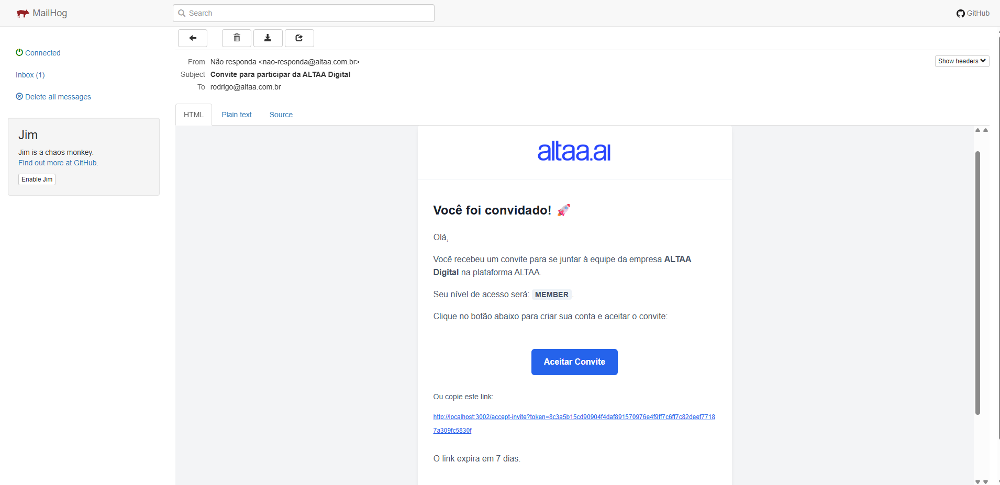
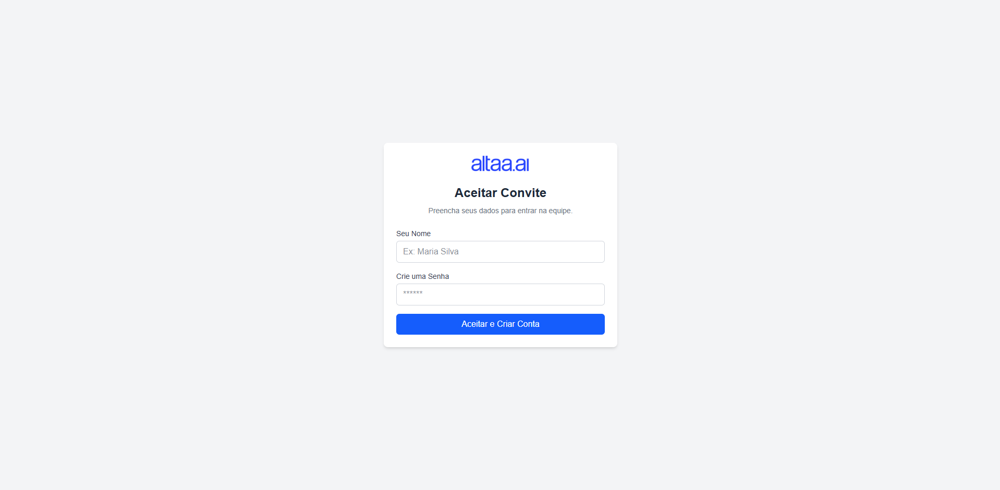
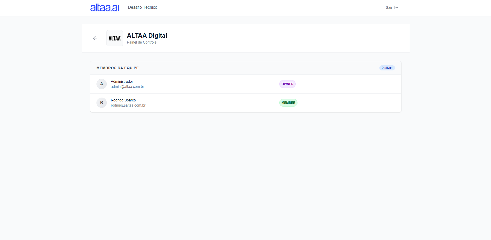
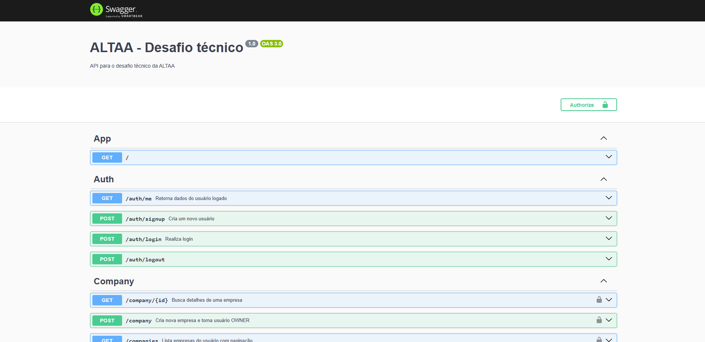
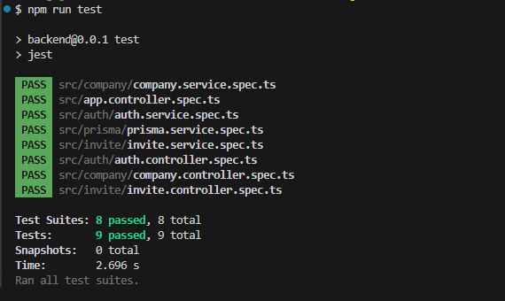

# ALTAA Digital - Desafio Técnico

Mini plataforma multi-tenant (com múltiplas empresas e usuários), gestão de membros e convites via e-mail.

### Pré-requisitos
- Docker

## Passos para executar localmente
```bash
cp .env.example .env
docker-compose --env-file .env up -d
```

### Links relacionados à aplicação
- [Documentação da API - Swagger](http://localhost:3003/docs)
- [Frontend](http://localhost:3002)
- [Visualização de e-mails (MailHog)](http://localhost:8025)

## Usuário inicial:
- E-mail: `admin@altaa.com.br`
- Senha: `123456`

## Stack tecnológica e decisões

### Backend (NestJS)
Escolhi o **NestJS** pela sua arquitetura modular e integração nativa com TypeScript, é robusto e permite escalarmos a aplicação com maior facilidade, simplificou a implementação de autenticação, integração com o Prisma e também o disparo de e-mail. No backend foi implementado todas as checagens de segurança para garantir que o usuário que está tentando realizar a operação (listagem/inserção) esteja devidamente qualificado com as permissões necessárias de acordo com seu papel.

- **ORM:** Prisma (Tipagem forte e facilidade com relações, muito prático a forma como podemos definir as entidades e já conseguir trabalhar com migrations). Realizei a implementação de `seed` para popular dados iniciais da plataforma.
- **Banco:** PostgreSQL (Robustez para dados relacionais, muito performático).
- **Auth:** Passport-JWT + Cookies (Maior segurança contra possíveis ataques).
- **Email:** Nodemailer + MailHog (Simulação de SMTP local). Ao invés de simplismente mostrar um log, optei por já implementar o disparo de e-mail para ter uma melhor experiência de uso da ferramenta.

### Frontend (Next.js)
Utilizei **Next.js 16** por ser um framework moderno e que permite termos uma aplicação de alto nível, com diversas configurações que facilitam o desenvolvimento, por exemplo a parte de roteamento, middleware e uso de recursos para controlar formulários e estados, além de também poder trabalhar com componentes

- **Estilização:** TailwindCSS (Produtividade e padrão de mercado, agiliza muito e não precisamos trabalhar diretamente com CSS "na mão").
- **HTTP:** Axios (simplifica a execução de requisições para o backend, muito prático e ágil)
- **

### Docker
Ambiente totalmente containerizado com Docker (Banco de dados, SMTP, API e Frontend).

---

## Ambiente de testes

Realizei a configuração da plataforma em uma VPS para facilitar o acesso e os testes, configurei o proxy reverso com `NGINX` e ativei o certificado SSL com `certbot`.

### Links para acesso
- [Documentação da API - Swagger](http://api.altaa.r7tech.com.br/docs)
- [Frontend](http://web.altaa.r7tech.com.br)
- [Visualização de e-mails (MailHog)](http://mail.altaa.r7tech.com.br)

### Testes
- Realizei a implementação de testes no `company.service`, onde testa a criação da empresa e checa se ocorreu tudo bem no procedimento. No final dos prints consta a imagem demonstrando a execução dos testes e o resultado, todos OK.

### Tempo total gasto
- Aproxidamente 18 horas totais, considerando backend, frontend, estruturação do docker, apontamento de DNS, configuração NGINX, SSL, deploy e correções pontuais identificadas para execução na VPS.

### Prints para demonstração

- Tela inicial


- Login


- Listagem empresas


- Gestão da empresa selecionada


- Envio de convite


- Convite recebido


- Detalhes do e-mail do convite


- Aceitar convite


- Acesso na empresa após aceitar o convite


- Swagger


- Testes (Backend)


Obs: utilizei meu domínio principal e habilitei os subdomínios para viabilizar a disponibilização da plataforma

Qualquer dúvida fico à disposição: (34)99222-6453 | rodrigocarvalhosoares@gmail.com